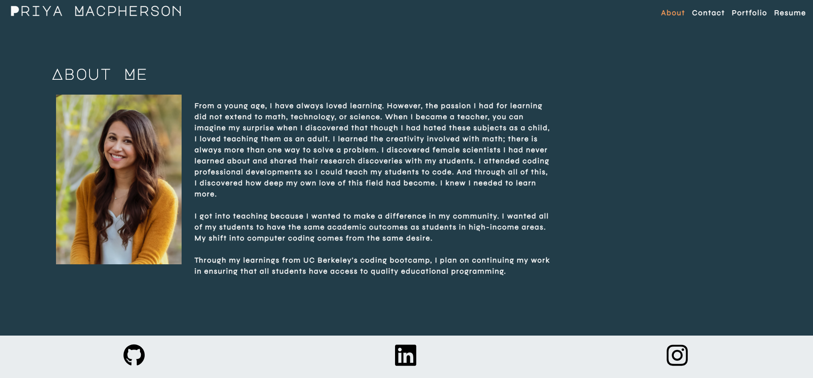

# React Portfolio

## User Story

```
AS AN employer looking for candidates with experience building single-page applications
I WANT to view a potential employee's deployed React portfolio of work samples
SO THAT I can assess whether they're a good candidate for an open position
```

## Description

When first viewing the portfolio, employers see an About section with a photo and description of the candidate. They also see a navigation with titles corresponding to the differenet sections of the portfolio. The title that connects to the current section is highlighted.

When the Portfolio section is clicked, there are 6 cards with information about the candidate's work samples. Links allow the employer to see the deployed site and Github Repository.

When the Contact section is clicked, a contact form is presented. The employer can submit a message by putting their name, email, and a short message. If the employer moves their cursor out of one of the form fields without entering anything, they receive a warning message. If they also do not input a correct email address they will receive a message.

When the Resume section is clicked, there is a link to a downloadable resume and a list of the candidate's skills.

When the employer looks at the Footer section, they will see icon links to the candidate's GitHub, LinkedIn, and Instagram.

## Table of Contents

- [Deployed Site](#deployedsite)

- [Screenshot](#screenshot)

- [Contribution](#contribution)

- [Questions](#questions)

## Deployed Site

Please visit the deployed site [here](https://pmac16.github.io/React-Portfolio/).

## Screenshot



## Contribution

All contributions are welcome. Please visit the [issues](https://github.com/pmac16/React-Portfolio/issues) tab to contribute.

## Questions

If you have additional questions, please visit me on [Github](https://github.com/pmac16)
